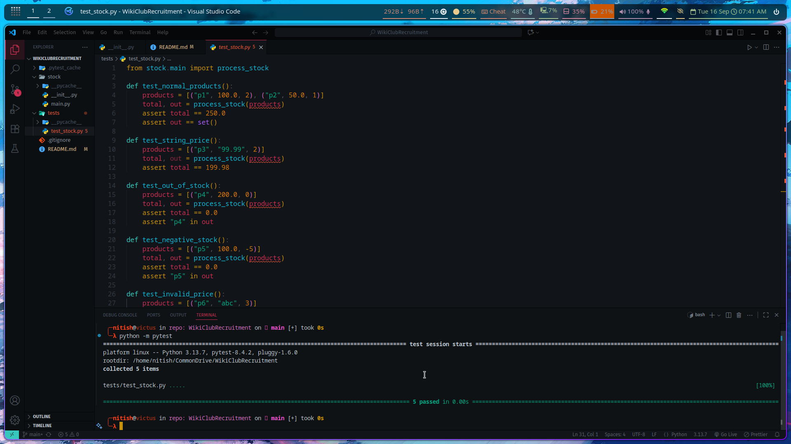

# WikiClubRecruitment - Stock Processing Module

Python module for processing product stock data. Calculates total stock value and identifies out-of-stock or invalid products.

---

## Installation & Setup

Clone the repository:

```bash
git clone <repository-url>
cd WikiClubRecruitment
```
Install Dependencies (only for testing)
```bash
pip install pytest
```
Running Tests

* Run tests from the project root:
```bash
python -m pytest
```
## Test Output



